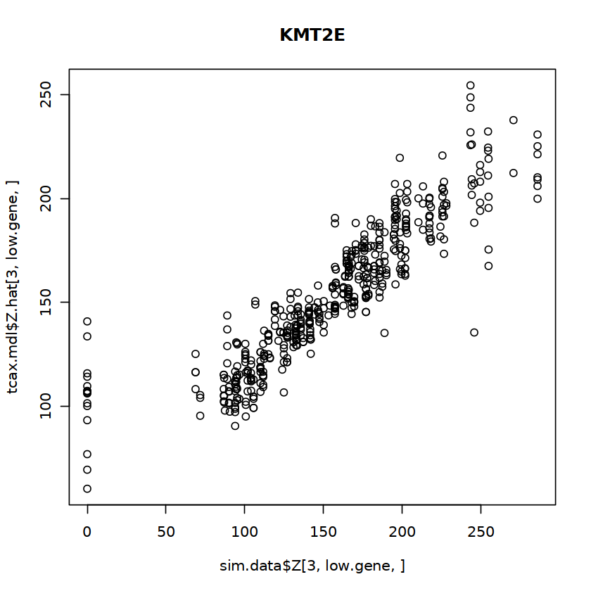
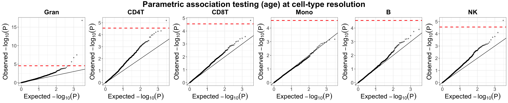
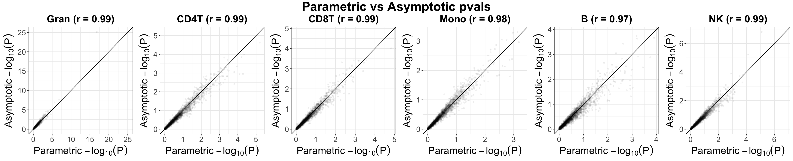
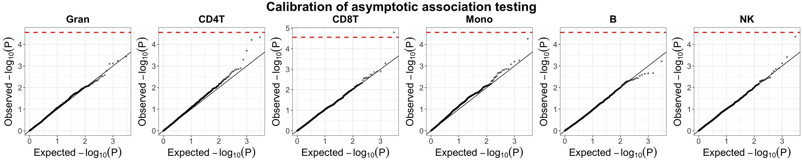

```{r, eval=F, include = FALSE}
knitr::opts_chunk$set(
  collapse = TRUE,
  comment = "#>"
)
```
# Load the Unico package and 
```{r eval=F, setup}
library(Unico)
library(matrixStats)

#For visualization in this vignette
install.packages(c("ggplot2","ggpubr","hexbin","egg"))
source("https://github.com/cozygene/Unico/raw/main/vignettes/vignetts.utils.r")
```


# Deconvolution on pseudobulk RNA expression data

Let's first load a small simulated pseudo-bulk PBMC expression profiles using data from the Stephenson et al, where the hidden cell-type specific expression profile is also known. We can obtain this toy dataset with the following command
```{r eval=F}
data_path <- "./"
if(!file.exists(file.path(data_path, "pbmc.rds"))){
	download.file("https://github.com/cozygene/Unico/raw/main/vignettes/pbmc.rds", file.path(data_path,"pbmc.rds"))
}
sim.data = readRDS(file.path(data_path,"pbmc.rds"))
```

We use the `Unico` function to fit the Unico model. In this simple simulation, we ignore covariates that could affect the expression profile at cell-type level (C1) and tissue-level (C2). Once we have all the necessary model parameters, we can ask Unico to explicitly infer the hidden cell-types by genes by samples 3D tensor with function `tensor`. 
```{r eval=F, echo = T, results = 'hide'}
unico.res = list()

#parameter learning 
unico.res$params.hat <- Unico(sim.data$X, sim.data$W, C1 = NULL, C2 = NULL, parallel = TRUE)

#tensor 
unico.res$Z.hat = tensor(sim.data$X, W = sim.data$W, C1 = NULL, C2 = NULL, 
                         unico.res$params.hat, parallel = FALSE)

```
To evaluate the performance of Unico, we now check per gene, at cell-type resolution, what is the correlation between our inferred tensor and the ground truth cell-type-level profiles across all samples. We repeat this process for all genes.
```{r eval=F, echo = T, results = 'hide'}
# evaluate tensor performance on features with variation 
unico.res$Z.corrs = calc_Z_corrs(Z.true = sim.data$Z.scale,
                                 Z.hat  = unico.res$Z.hat, 
                                 eval.feature.source = sim.data$variable.feature.source)

colMedians(unico.res$Z.corrs)
```
The median correlation (across all genes) for each of the cell types are: 0.86, 0.77, 0.79, 0.58, 0.66 for CD4 T cells, NK cells, CD8 T cells, Monocytes, B cells respectively.


To visualize the result, we randomly pick a gene (in the top 25% low entropy quantile) and visualize the estimated and the ground truth expression level at an arbitrary cell type (e.g. third most abundant)

```{r eval=F, echo = T, results = 'hide', fig.show='hide'}
low.gene = sample(rownames(sim.data$params$entropies[sim.data$params$entropies < quantile(sim.data$params$entropies, 0.25), ,drop= F]), 1)

plot(sim.data$Z[3,low.gene, ], unico.res$Z.hat[3,low.gene, ]) + title (low.gene)
```
```{r echo = FALSE, out.width = "400px"}
#| fig.cap = "Correlation between estimated source-specific profile and the ground truth"
knitr:: 
```


# Cell-type level differential methylation analysis
Unico also offers association testing at cell-type resolution. Let's look at two publicly available bulk methylation datasets collected on whole blood. Instead of looking at close to 450k CpG sites genmone-wide, in this tutorial, we have selected a subset of just 3000 arbitrary CpG sites spread across the autosomes. In addition, we collected covariates reported by the original author and computed 20 components that are expected to capture technical variation in the data. These components were constructed by calculating the first 20 principal components from a set of 10,000 control probes that are not expected to capture biological variation but only technical variability in an approach similar to the one suggested by Lehne et al. Since we did not use the raw IDAT files, we considered 10,000 sites with the lowest variance in the data as control probes. You can obtain a pre-processed version with the following command. 
```{r eval=F, echo = T, results = 'hide'}
data_path <- "./"
if(!file.exists(file.path(data_path, "liu.rds"))){
	download.file("https://github.com/cozygene/Unico/raw/main/vignettes/liu.rds", file.path(data_path,"liu.rds"))
}
if(!file.exists(file.path(data_path, "hannum.rds"))){
	download.file("https://github.com/cozygene/Unico/raw/main/vignettes/hannum.rds", file.path(data_path,"hannum.rds"))
}
liu    = readRDS(file.path(data_path,"liu.rds"))
hannum = readRDS(file.path(data_path,"hannum.rds"))
```

We similarly use the `Unico` function to fit the model on Liu et al.'s data. Unlike in the gene expression simulation, we provide additional covariates that could affect the observed methylation profile. Specifically, we set cell-type level covariates `C1` to age, sex, disease status and smoking status, and tissue-level covariates C2 to technical variation components. Once we have all the necessary model parameters, we can ask Unico to perform parametric association testing under the assumption that methylation levels are normally distributed.
```{r eval=F, echo = T, results = 'hide'}
source.ids   = colnames(liu$W)
n = ncol(liu$X)
m = nrow(liu$X)
k = ncol(liu$W)
```
```{r eval=F, echo = T, results = 'hide'}
unico.liu = list()
unico.liu$params.hat = Unico(X  = liu$X, W = liu$W,
                             C1 = liu$cov[, c("age", "sex", "disease","smoking")],
                             C2 = liu$ctrl_pcs) 

unico.liu$params.hat = association_parametric(X = liu$X, unico.liu$params.hat)
```

Now, perform similar model fitting and association testing on an independent data set (Hannum et.al.).
```{r eval=F, echo = T, results = 'hide'}
unico.hannum = list()
unico.hannum$params.hat = Unico(X  = hannum$X, W = hannum$W,
                                C1 = hannum$cov[, c("age", "sex", "ethnicity")],
                                C2 = cbind(hannum$ctrl_pcs, hannum$cov[,"plate", drop = F])) 

unico.hannum$params.hat = association_parametric(X = hannum$X, unico.hannum$params.hat)
```

Unico reports both the marginal test (T-test) on the effect size of each covariate at cell type resolution as well as a joint test (partial F-test) that evaluates the joint effects of each of the covariate on the mixture profile. Let's first look at the reported marginal association testing results: 
```{r eval=F, echo = T, results = 'hide'}
liu.marg.pvals    = unico.liu$params.hat$parametric$gammas_hat_pvals[, paste0(source.ids, ".age")]
hannum.marg.pvals = unico.hannum$params.hat$parametric$gammas_hat_pvals[, paste0(source.ids, ".age")]
print(sum(liu.marg.pvals < 0.05/(m*k)))
print(hannum.marg.pvals[liu.marg.pvals < 0.05/(m*k)])
```
Using Liu et al.'s data as discovery, we have 4 CpG-cell-type pairs crossing the Bonferroni adjustment (on both number of CpG sites and number of cell types under test). All of which are replicated in our validation data set (Hannum et al.). 

```{r eval=F, echo = T, results = 'hide', fig.height=4.5, fig.width=22}
qq_age_g = plot_qq(pvals_mat = liu.marg.pvals,
                   labels = source.ids, 
                   ggarrange.nrow = 1, ggarrange.ncol = k, 
                   alpha = 0.5, text.size = 20,
                   title = "Parametric association testing (age) at cell-type resolution")
qq_age_g
```

```{r echo = FALSE, out.width = "675px"}
#| fig.cap = "Evaluation of Unico’s parametric statisitcal testing p-values for cell-type level differential methylation with age in whole-blood
#| 		datasets (Liu et al.). Presented are quantile-quantile plots with log-transformed expected p-values versus
#| 		the observed p-values. Red horizontal dashed lines indicate the Bonferroni-corrected threshold, adjusting for the number of CpGs and
#| 		the number of cell-types under test."
knitr:: 
```

We now check the reported joint association testing results:
```{r eval=F, echo = T, results = 'hide'}
liu.joint.pvals    = unico.liu$params.hat$parametric$gammas_hat_pvals.joint[, "age"]
hannum.joint.pvals = unico.hannum$params.hat$parametric$gammas_hat_pvals.joint[, "age"]
print(sum(liu.joint.pvals < 0.05/m))
print(sum(hannum.joint.pvals[liu.joint.pvals < 0.05/m] < (0.05/sum(liu.joint.pvals < 0.05/m))))
```
Using Liu et al.'s data as discovery, and Hannum et al.'s data as validation set. We have 159 out of 206 discovery replicated. 


## Perform association testing under no distribution assumption 
Alternatively, we can ask Unico to perform association testing under no distribution assumption. 
```{r eval=F, echo = T, results = 'hide'}
unico.liu$params.hat = association_asymptotic(X = liu$X, unico.liu$params.hat)
liu.marg.pvals.asym  = unico.liu$params.hat$asymptotic$gammas_hat_pvals[, paste0(source.ids, ".age")]
```
Empirically, we observed that asymptotically-derived p-values are highly correlated with their parametric counterparts
```{r eval=F, echo = T, results = 'hide', fig.height=4.5, fig.width=22}
qq_compare_g = plot_qq_compare(pvals_mat1 = liu.marg.pvals,
                               pvals_mat2 = liu.marg.pvals.asym,
                               labels = source.ids, 
                               ggarrange.nrow = 1, ggarrange.ncol = k, 
                               alpha = 0.05, text.size = 20,
                               xlab = "Parametric", ylab = "Asymptotic", 
                               title = "Parametric vs Asymptotic pvals")
qq_compare_g
```
```{r echo = FALSE, out.width = "675px"}
#| fig.cap = "Evaluation of Unico’s asymptotically-derived p-values under non-parametric testing
#| 		for cell-type level differential methylation with age in whole-blood dataset (Liu et al.). Presented are
#| 		scatter plots showing log-transformed p-values under the assumption that methylation levels
#| 		are normally distributed (“Parametric”) versus the corresponding log-transformed p-values of
#| 		a non-parametric test (“Asymptotic”)."
knitr:: 
```


## Calibration of asymptotically-derived p-values under null

To evaluate whether Unico's asymptotically-derived p-values are well calibrated under the null, we can shuffle the covariates of interest, refit the model and ask for cell-type level association in this permuted data set. We will use age as our running example. Since we now arbitrarily assigned age to each sample, irrespective to his or her true biological age, it is expected that his or her methylation profile reflects no signal with respect to our assigned age, and thus we should obtain close to 0 detection. 
```{r eval=F, echo = T, results = 'hide'}
C1.shuffle = hannum$cov[, c("age", "sex", "ethnicity")]
C1.shuffle[, "age"] = hannum$cov[sample(1:nrow(hannum$cov)), "age"]

unico.hannum.shuffle = list()
unico.hannum.shuffle$params.hat = Unico(X  = hannum$X, W = hannum$W,
                                        C1 = C1.shuffle,
                                        C2 = cbind(hannum$ctrl_pcs, hannum$cov[,"plate", drop = F])) 
unico.hannum.shuffle$params.hat = association_asymptotic(X = hannum$X, unico.hannum.shuffle$params.hat)
unico.marg.pvals.asym.calib = unico.hannum.shuffle$params.hat$asymptotic$gammas_hat_pvals[, paste0(source.ids, ".age")]
```
Indeed, under the null, we see the quantile-quantile plots fall along the diagonal 
```{r eval=F, echo = T, results = 'hide', fig.height=4.5, fig.width=22}
qq_calib_g = plot_qq(pvals_mat = unico.marg.pvals.asym.calib,
                     labels = source.ids, 
                     ggarrange.nrow = 1, ggarrange.ncol = k, 
                     alpha = 0.5, text.size = 20,
                     title = "Calibration of asymptotic association testing")
qq_calib_g

```

```{r echo = FALSE, out.width = "675px"}
#| fig.cap = "Evaluation of the null distribution of Unico’s asymptotically-derived p-values under
#| 		non-parametric testing for cell-type level differential methylation with age in whole-blood
#| 		datasets (Hannum et al.). Presented are quantile-quantile plots with log-transformed expected p-values versus
#| 		the observed p-values under permutations of the condition (i.e., under the null). Red horizontal
#| 		dashed lines indicate the Bonferroni-corrected threshold, adjusting for the number of CpGs and
#| 		the number of cell-types under test."
knitr:: 
```


